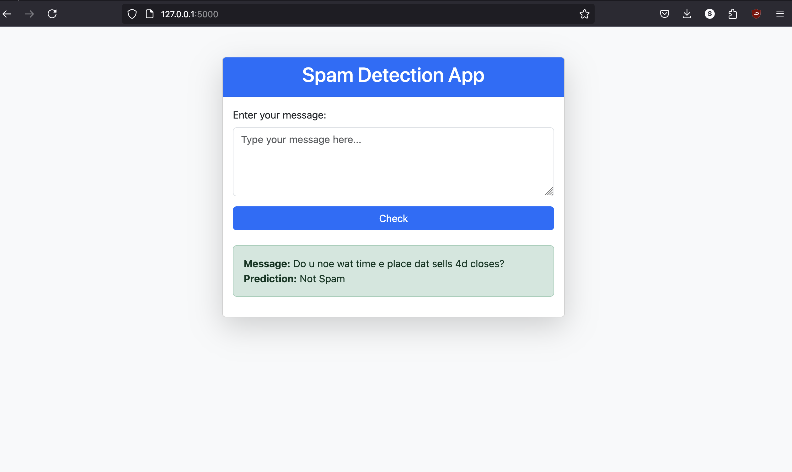

📧 Spam Detector using Machine Learning
 
A web-based spam detection system that classifies messages as Spam or Ham using TF-IDF, Naïve Bayes, Random Forest, and Stacking Ensemble. The model is trained on a dataset of SMS messages and deployed using Flask.
 
 
🚀 Features
 

Spam Classification: Predicts whether a message is spam or not.

ML Model: Uses TF-IDF + Stacking (Random Forest + Naïve Bayes + Logistic Regression).

Web Interface: Built with Flask and Bootstrap.

Hyperparameter Tuning: Optimized with GridSearchCV.

Supports n-grams: Captures bigrams & trigrams to improve accuracy.
 
 
 
🛠️ Installation & Setup
 
 
1️⃣ Clone the Repository

git clone https://github.com/sh78ba/SMS_Spam_Detector.git
 
cd SMS_Spam_Detector
 
2️⃣ Create a Virtual Environment (Recommended)
 
 
# Windows
python -m venv venv
venv\Scripts\activate

# macOS/Linux
python3 -m venv venv
source venv/bin/activate

3️⃣ Install Dependencies

pip install -r requirements.txt

4️⃣ Train the Model

python model/train.py

💪 This will train the spam detector and save the model.

5️⃣ Run the Web App

python app.py

🌐 Open in browser: http://127.0.0.1:5000
 
 
 
📂 Project Structure
 
 
📁 Spam_Detector
│── 📁 model                # Model training & processing
│   ├── train.py            # Trains the spam detection model
│   ├── spam_model.pkl      # Saved trained model
│── 📁 static               # Static assets (CSS, JS)
│   ├── style.css           # Styling for the web app
│── 📁 templates            # HTML templates
│   ├── index.html          # Web UI for user input
│── app.py                  # Flask app for serving predictions
│── requirements.txt        # Required dependencies
│── README.md               # Project Documentation
 
 
🛀 Dependencies
 
Flask

Scikit-learn

Pandas

Numpy

NLTK

Install them with:

pip install -r requirements.txt
 
 
📊 Model Performance
 
Metric
 
Score

Accuracy

98%

Precision

98%

Recall

90%

F1-Score

94%
 
 
 
💡 How It Works
 
 
User Inputs a Message: Enters text in the web app.

Text Preprocessing: Removes stopwords, converts to lowercase, and extracts features using TF-IDF.

Model Prediction: The trained Stacking Classifier predicts whether the message is spam.

Result Displayed: The app shows the classification result.

 
 
Output:
 

